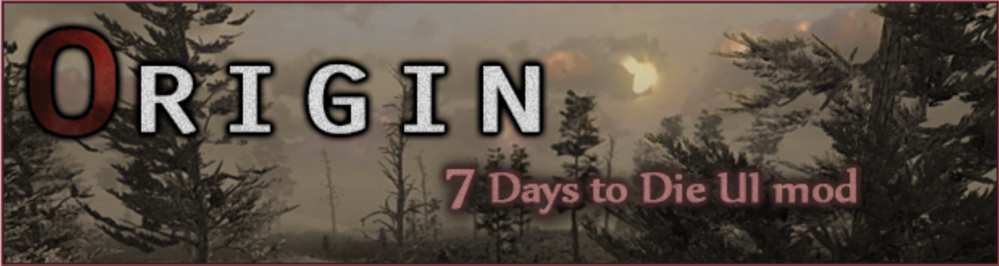

There are already rather many UI mods to 7 Days to Die and this is Tritox’s contribution. The mod isn’t entirely new, he just (finally) came up a name for it. The old version(Tuning the A13 UI) for this mod won’t be updated anymore.

The main idea of Origin is to keep the UI’s look as close as possible to the original 7DTD UI (hence the mod name) while spicing up the UI with some quality of life changes. Though Tritox do keep the right to slightly deviate from this guideline if it’s best for the overall look of the mod.
Features

* **Top left**: Re-positioned day and time coupled with the world temperature and elevation indicators.
* **Top center**: Added indicator to compass to show which way the player is facing.
* **Top right**: Added text outlines to active quest tracker.
* **Bottom left**: Added bars for water, food and feels like -temperature above the current stamina and health Bars.
* **Bottom center**: Added player level indicator left from the XP bar and numbers for toolbelt slots.

“I remember seeing coordinates in the HUD, where are they?”

In A14, a bug was introduced to the UI which causes several unexpected errors if the player adds waypoints while the coordinate indicators is on. Later on, in A16, enabling the coordinates caused the UI pretty much to exploded, so they were removed entirely from the and they aren’t coming back.

“Can you change the temperature to Celcius?”

The temperature unit can be changed by yourself in the console (works in MP only if you are an admin). Type settempunit c for Celcius and settempunit f for Fahrenheit.

“Why there is only a static fill for the core temperature bar?”

The core temperature is just a value in the game UI and there isn’t any changing fill related to it like there is for food/water/etc.

“Can this mod be used in multiplayer games?”

Only if the host uses the mod. 7DTD multiplayer servers push most of the game files to the clients, including the XML files which this UI mod uses. So even if you have this mod installed and the server you play on doesn’t, you are forced to use the whatever UI the server uses.

“I don’t like the feature X in your mod”

And you absolutely shouldn’t. This is a matter of taste like oh-so-many other things in the world. Luckily, you can always remove/add parts to your liking. He has tried to comment the mod files well and removing features pretty much comes down to comment out or remove sections from the XML files. If you don’t know how to do this, he can probably help you out to some extent.

**CHANGELOG**
a20 - Bugfix for food & water bars not working, displaying the wrong value or otherwise not working. Updated to use percentage.

**Modifications/Copying**

This mod, like many others in this wonderful community is consider opensource. You may copy it, modify it, distribute it. The only request is to make sure that everyone listed in the credits below are included, to call recognition to the many people who have contributed over the years to the creation and ongoing maintenance of this mod.

**Credits**

* Tritox, for his original work to create this, and the years put in maintaining this.
* Big thanks to all the people in the forums who have helped with the UI hacks: Sirillion & Red Eagle LXIX
* Thank you to all the other UI modders who have given him good tips and ideas! Also huge thanks to YseGuy for creating the initial XPath mod version and helping out with various fixes. Oh, and of course huge kudos for The Fun Pimps for creating this major timesink of a game for us.
* ShoudenKalferas, for picking up on-going maintenance of this mod from A19 onward.

Original Forum thread: https://community.7daystodie.com/topic/3984-origin-ui-mod/